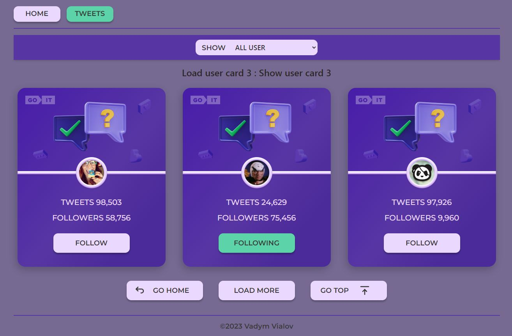

# Тестове завдання Follower

## для виконання завдання використане:

  - `React` для створення логіки роботи всіх частин проекту
  - `RTKQ` для запитів на сервер бекенду
  - `Persist` для сбереження відмічених (зафоловленх) юзерів у localStorage
  - `Router` для маршрутизації 
  - Для візуального оформлення використовувались:
    - Tailwind CSS
    - Style-componets
    - react-hot-toast
    - react-toastify
    - react-scroll
    - react-icons

## Завдання виконане в повному обсязі відносно до техгічного завдання

## Мета: створити картки твітів та додати інтерактивності при клікові на кнопку.

### Технічне завдання (основне)

1. Відповідно до макету потрібно реалізувати картки юзера.
2. При клікові на кнопку Follow - текст змінюється на Following. Також
   змінюється колір кнопки. А до кількості фоловерів додається і ваш. Тобто,
   початкова кількість складає 100,500 фоловерів. При клікові на кнопку буде
   100,501.
3. При оновлені сторінки має фіксуватись кінцевий результат дій юзера. Тобто,
   якщо клікнути по кнопці і оновити сторінку - то кнопка все рівно залишається
   в стані Following із відповідним кольором, а кількість фоловерів НЕ
   зменшується до початкового значення.
4. При повторному клікові на кнопку її текст та колір змінюються до початкового
   стану. Також змінюється і кількість фоловерів. Вона зменшується на 1
   (100,500).
5. В коді цифра 100,500 має бути прописана одним значенням (100500). В UI -
   виведено через кому (100,500).

### Створи свій персональний бекенд для розробки за допомогою UI-сервісу mockapi.io. Створи ресурс users.

1. Створюєте юзера в Mockapi з наступними полями: id, user, tweets, followers,
   avatar
2. Зображення аватарів мають бути прописані окремими url у властивості “avatar”.
3. Має бути від 12 юзерів з різними значеннями(на ваш розсуд) в базі. Зроби
   пагінацію. На одній сторінці пагінації має відображатися від 3 твітів
4. Решта підгружатись при натисканні Load More

### Технічне завдання (додаткове)

1. Створи маршрутизацію, використовуючи React Router.
   - У застосунку повинні бути такі маршрути. Якщо користувач зайшов за
     неіснуючим маршрутом, його необхідно перенаправляти на домашню сторінку.
   - '/' – компонент Home, домашня сторінка. Стилізація та оформлення на ваш
     розсуд
   - '/tweets' - компонент tweets, сторінка із відображенням твітів На сторінці
     tweets має бути кнопка Back, яка веде на головну сторінку.
2. Додати фільтрацію. Це має бути Dropdown із 3 опціями(оформлення на ваш
   розсуд):
   - show all, follow, followings show all - показати всі твіти.
   - follow - показати твіти, у яких стан follow.
   - followings - показати твіти, у яких стан following
   -

# Критерії виконання

- Верстка фіксована в рх, семантична та валідна.
- Немає помилок в консолі браузера.
- Робота виконана на нативному JS з використанням зборщиків або на React.
- Інтерактивність працює відповідно до технічного завдання.
- Код відформатований та без коментарів.
- В репозиторії має бути описаний README.md.
